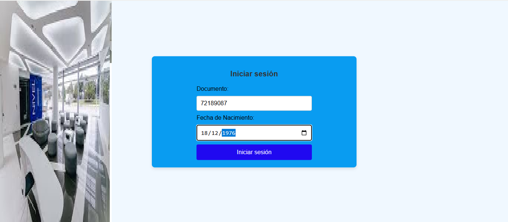
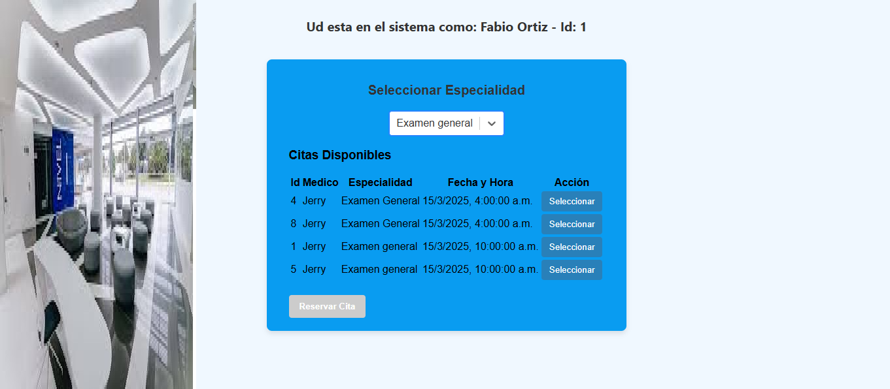
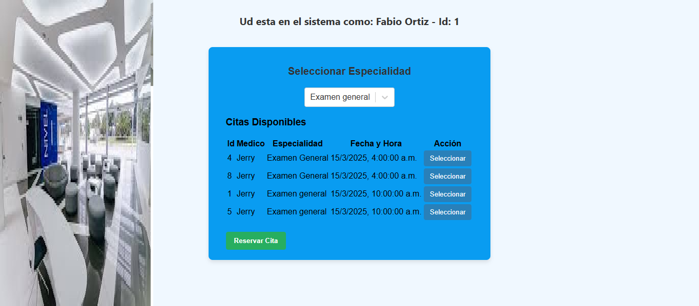

# Getting Started with Create React App

Instalar
    "axios": "^1.9.0",
    "jwt-decode": "^4.0.0",
    "react-dom": "^19.1.0",
    "react-router-dom": "^7.5.3",

#Ingreso al sistema
el Usuario debera logerase con su no. de cedula y su fecha de nacimiento

si las credenciales son correctas ingresara al menu principal, donde podra seleccioanr el tipo de servicio medico requerido: General u odontologico

Una vez seleccione la cita mas cercana o de acuerdo a sus prioridades se activara y debera dar clic en el boton reservar

#podra imprimir la tabla de citas disponibles si lo desea

